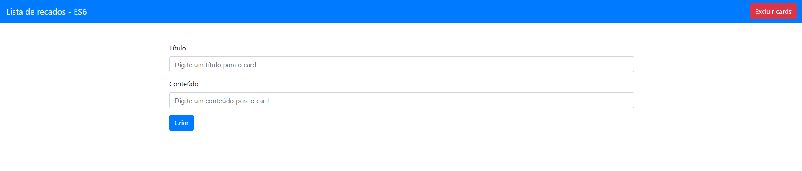

# gs3-scrapbook

## 💻 Projeto

O Scrapbook é uma aplicação no estilo de lista de tarefas. Mais especificamente, um formulário que permite adicionar cards diretamente na tela. Foi a primeira aplicação em que utilizamos o framework **Bootstrap** para contruir o layout.

## 🚀 Tecnologias

Este projeto foi desenvolvido com as seguintes tecnologias:

- [HTML](https://github.com/topics/html)
- [Bootstrap](https://github.com/topics/bootstrap)
- [JS](https://github.com/topics/js)

## :sparkles: Funcionalidades

- Adicionar cards
- Geração automática de avatar para cards individuais
- Editar cards individuais
- Excluir cards individuais
- Excluir todos os cards
- Persistir na aplicação os dados dos cards criados

## :construction: Ideias de melhorias

:heavy_check_mark: A melhoria mais urgente no momento é consertar o bug que impede a edição de cards individuais.
- Fechar o modal do card automaticamente quando o conteúdo é editado.

## :memo: Licença

Esse projeto está sob a licença MIT. Veja o arquivo [LICENSE](LICENSE.md) para mais detalhes.